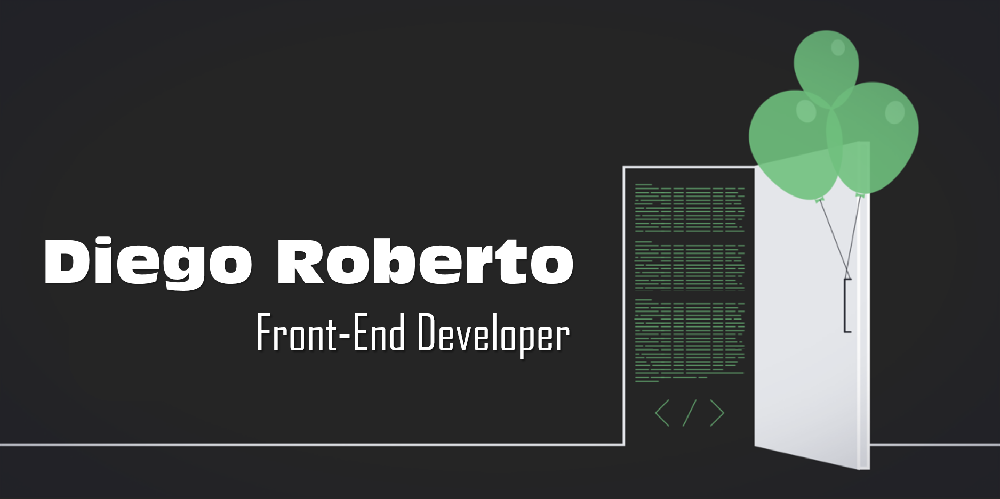

# Olá, seja bem-vindo(a)!
# Eu me chamo Diego. Prazer em conhecê-lo(a)! 

## 🔖 Sobre mim 
Minha experiência com a programação iniciou-se no Ensino Médio Técnico, onde foram explanados os conceitos basilares para adentrar ao mundo da programação e após tais estudos chegar no momento de "colocar a mão na massa", momento esse, que alguns algoritmos foram criados nas linguagens Pascal, Clipper, Linguagem C, Delphi e Visual Basic 6. 

No decorrer dos anos, me aprofundei um pouco mais na área e desenvolvi programas em Visual Basic 6, alguns deles ainda são utilizados até os dias de hoje <i>(2022...risos)</i>.

Atualmente, encontro-me buscando conhecimentos para atuar na área de desenvolvimento Front-End.

- :dart: Objetivo: me tornar **Desenvolvedor Full-Stack** e ingressar na área
- :books: Estudos: Adquirindo conhecimentos em JavaScript, TypeScript, Node.js, APIs, MySQL, CSS e seus frameworks.

## 🚀 Minhas Hard Skills 

  
  
  
  
  

 
 
  ## 📧 Contato
  

   
    
  

   

  ##
  

## 🔄 GitHub Stats

  

  
 